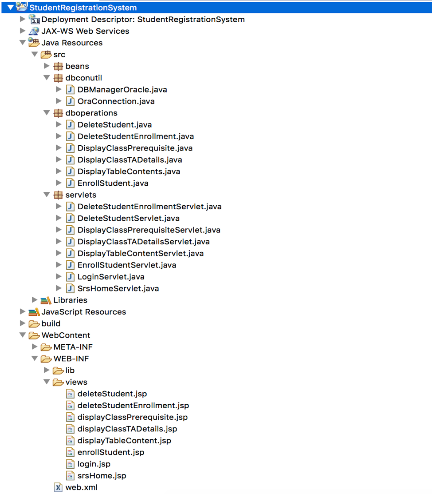

## STUDENT REGISTRATION SYSTEM (SRS Application)

#### General Information:
* This Application is developed by Team of 3 members where we worked in below phases:

	* Requirement gathering and understanding phase.
	* Analysis and planning phase.
	* Development phase.
	* Testing phase.
	* Defect fixing phase.
	* Demo phase.

--------------------------------------------------------------------------------------------------------------------

#### High Level Architecture:

* We followed Model View Controller (MVC) architecture in order to implement SRS application.
	* View
		* Using JSP (Java Server Pages) to create frontend GUI to interact with users.
	* Controller
		* Using Java Servlets to call DB operator classes and redirect result to appropriate JSP pages.
	* Model
		* Using JDBC connections and calling respective DB procedures in order to perform user's request.
* JSPs are dynamic web pages where we can write HTML as well as Java codes.
* Using HTTP method "post" to transfer form elements from frontend to backend.
* Every functionality is implemented in separate files (JSP, Servlet, DB operation class) for modularity.
* Handled messages displayed via DBMS_OUTPUT from backend in Java code DBMS_OUTPUT GET_LINE procedure call.
* Basic validations like empty fields entries are done at frontend side.
* Majority of functionalities to manipulation DB data and related validations are implemented at backend side.

#### Development Phase Plan and Activities:

* We followed below steps during project planning phase of SRS application:
	* Discussed and decided to use JSP as frontend, JDBC connectivity and Oracle PL/SQL backend.
	* Discussed and decided to use "BitBucket" version control tool to maintain project source code both for backend and frontend components.
	* Discussed and decided to use PL/SQL Developer IDE to develop database objects like package, procedures, functions, sequence, triggers and test cases (SQL scripts).
	* Discussed and decided to use Eclipse IDE to develop web application project including JSPs, Java Servlets and Java JDBC connectivity related model classes.

|  Meeting Date  |   Meeting Location   | Activities                                                                                                                                                                                             |
|:--------------:|:--------------------:|--------------------------------------------------------------------------------------------------------------------------------------------------------------------------------------------------------|
|  Nov 6th, 2018 | Library Meeting Room | Created BitBucket repositories and base package for SRS [NM]. Included procedures to display table tuples [VM]. Implementation of procedure to get TA details using classid [DP].                      |
| Nov 10th, 2018 | Library Meeting Room | Test case for “class_ta” and code formatting [VM]. Included ref cursor in show_tables + it'd test case [DP]. Data population for test case and Java web project setup [NM].                            |
| Nov 11th, 2018 | Library Meeting Room | Included implementation of “prerequisite course” procedure [NM]. Included partial implementation - “enroll student” procedure [VM]. Implemented display table fields in Java and DB connectivity [DP]. |
| Nov 12th, 2018 | Library Meeting Room | Partial implementation of “Drop enrollments” without trigger [DP]. “Show_Students” functionality testing at front end side [VM]. Fixing of “Show_Students” DB defects and test cases [NM].             |
| Nov 13th, 2018 | Library Meeting Room | Implementation and testing of “Drop Student Enrollment” from backend and frontend side [DP] [VM] [NM].                                                                                                 |
| Nov 14th, 2018 | Library Meeting Room | Implementation of validation 8 for Enroll_Student procedure [DP]. Test case + related sql script to check student enrollments [NM]. Implementation of TA Details functionality at frontend [VM].       |
| Nov 15th, 2018 | Library Meeting Room | Testing for triggers while enrolling student at backend [VM]. Implementation of Display Class Prerequisite at frontend [DP]. Partial code and testing of Delete Student at frontend [NM].              |
| Nov 19th, 2018 | Library Meeting Room | Combined implementation of Enroll and Delete Student Enrollment with complete testing from frontend and backend [DP] [VM] [NM].                                                                        |
| Nov 26th, 2018 | Library Meeting Room | Combined implementation of Delete Student with complete testing from frontend and backend [DP] [VM] [NM].                                                                                              |
| Nov 28th, 2018 | Library Meeting Room | Thorough testing of all the procedures, triggers and fixed defects together from frontend and backend side [NM] [VM] [DP].                                                                             |
| Nov 29th, 2018 | Library Meeting Room | Project Report and final DB setup for demo [VM] [NM] [DP].                                                                                                                                             |

* Team Members Roles and Responsibilities:
	* All team members worked together in same meeting room to develop and test SRS application from frontend and backend side.
	* Activities done by team members is mentioned in above table with respective initials.
		* Nitesh Mishra [NM]
		* Dipika Suresh Patil [DP]
		* Vidhi Mewada [VM]

--------------------------------------------------------------------------------------------------------------------

#### Outline of Backend PL-SQL Code

* **DB Package Name** - STUDENT_REGISTRATION_SYSTEM

* Procedures to display the tuples from each of the seven tables. These procedures return REF CURSOR as OUT parameter which is used at front-end side to display tuples of seven DB tables.
	* PROCEDURE SHOW_STUDENTS(REF_CURSOR_STUDENTS OUT REF_CURSOR);
	* PROCEDURE SHOW_TAS(REF_CURSOR_TAS OUT REF_CURSOR);
	* PROCEDURE SHOW_COURSES(REF_CURSOR_COURSES OUT REF_CURSOR);
	* PROCEDURE SHOW_CLASSES(REF_CURSOR_CLASSES OUT REF_CURSOR);
	* PROCEDURE SHOW_ENROLLMENTS(REF_CURSOR_ENROLLMENTS OUT REF_CURSOR);
	* PROCEDURE SHOW_PREREQUISITES(REF_CURSOR_PREREQUISITES OUT REF_CURSOR);
	* PROCEDURE SHOW_LOGS(REF_CURSOR_LOGS OUT REF_CURSOR);

* Global Types - 
	* TYPE REF_CURSOR IS REF CURSOR;
	* This REF CURSOR is returned from individual procedure as select query.

* Procedure to display B#, first name and last name of the TA for input classid.
	* PROCEDURE CLASS_TA(CLASSID_IN     IN CLASSES.CLASSID%TYPE, 
	TA_B#_OUT  OUT CLASSES.TA_B#%TYPE,
	FIRST_NAME_OUT OUT STUDENTS.FIRST_NAME%TYPE,
	LAST_NAME_OUT  OUT STUDENTS.LAST_NAME%TYPE);
	* Validations:
		* If the class does not have a TA, report "The class has no TA."
		* If the provided classid is invalid (i.e., not in the Classes table), report "The classid is invalid."

* Procedure returns all direct and indirect prerequisite courses.
	* PROCEDURE CLASS_PREREQ(DEPT_CODE_IN IN PREREQUISITES.DEPT_CODE%TYPE,
                         	COURSE#_IN   IN PREREQUISITES.COURSE#%TYPE, PRE_REQ_OUT  OUT VARCHAR2);
	* Validation:
		* If the provided (dept_code, course#) is invalid, report "dept_code || course# does not exist."

* Procedure handles enrollment of a student into a class.
	* PROCEDURE ENROLL_STUDENT(B#_IN      IN STUDENTS.B#%TYPE,
                          	CLASSID_IN IN CLASSES.CLASSID%TYPE);
	* Validations:
		* If the student is not in the Students table, report "The B# is invalid." 
		* If the classid is not in the classes table, report "The classid is invalid." 
		* If the class is not offered in the current semester (i.e., Fall 2018), reject the enrollment and report "Cannot enroll into a class from a previous semester." 
		* If the class is already full before the enrollment request, reject the enrollment request and report "The class is already full." 
		* If the student is already in the class, report "The student is already in the class." 
		* If the student is already enrolled in four other classes in the same semester and the same year, report "The student will be overloaded with the new enrollment." but still allow the student to be enrolled. 
		* If the student is already enrolled in five other classes in the same semester and the same year, report "Students cannot be enrolled in more than five classes in the same semester." and reject the enrollment. 
		* If the student has not completed the required prerequisite courses with at least a grade C, reject the enrollment and report "Prerequisite not satisfied."

* Procedure handles deletion of a student from enrollment table.
	* PROCEDURE DELETE_STUDENT_ENROLLMENT(B#_IN      IN STUDENTS.B#%TYPE,
                                CLASSID_IN IN CLASSES.CLASSID%TYPE);
	* Validations:
		* If the student is not in the Students table, report "The B# is invalid." 
		* If the classid is not in the Classes table, report "The classid is invalid." 
		* If the student is not enrolled in the class, report "The student is not enrolled in the class." 
		* If the class is not offered in Fall 2018, reject the drop attempt and report "Only enrollment in the current semester can be dropped."
		* If dropping the student from the class would cause a violation of the prerequisite requirement for another class, reject the drop attempt and report "The drop is not permitted because another class the student registered uses it as a prerequisite." In all the other cases, the student will be dropped from the class. 
		* If the class is the last class for the student, report "This student is not enrolled in any classes."
		* If the student is the last student in the class, report "The class now has no students."

* Procedure handles deletion of a student from the Students table based on a given B#.
	* PROCEDURE DELETE_STUDENT(B#_IN IN STUDENTS.B#%TYPE);
	* Validation:
		* If the student is not in the Students table, report "The B# is invalid."

* Related DB Objects - these objects are not part of package and used in application.
	* Sequence to generate log# automatically when new log records are inserted in log table.
		* LOG_SEQ_GENERATOR
	* Trigger to make entry in log table on deletion of enrollment table entry.
		* TRIG_ON_DEL_ENROLL_INS_LOGS
	* Trigger to decrease class size in CLASSES table on deletion of enrollment table entry.
		* TRIG_ON_DEL_ENROLL_UPD_CLASSES
	* Trigger to delete TA table entry on deletion of STUDENT table entry.
		* TRIG_ON_DEL_STUDENTS_DEL_TA
	* Trigger to make entry in log table on deletion of TA table entry.
		* TRIG_ON_DEL_TAS_INS_LOGS
	* Trigger to make TA column entry NULL in CLASSES table on deletion of TA table entry.
		* TRIG_ON_DEL_TAS_UPD_CLASSES
	* Trigger to make entry in log table on insertion of enrollment table entry.
		* TRIG_ON_INS_ENROLL_INS_LOGS
	* Trigger to increase class size in CLASSES table on insertion of ENROLLMENTS table.
		* TRIG_ON_INS_ENROLL_UPD_CLASSES
	* Trigger to make entry in log table on update of CLASSES table entry.
		* TRIG_ON_UPD_CLASSES_INS_LOGS
	* Trigger to delete enrollment on deleting student entry.
		* TRIG_ON_DEL_STUD_DEL_ENROLL

--------------------------------------------------------------------------------------------------------------------

#### Outline of Frontend and Java Code

* Below is the directory structure snippet for Java Dynamic Web Project using Model View Controller architecture model:

--------------------------------------------------------------------------------------------------------------------